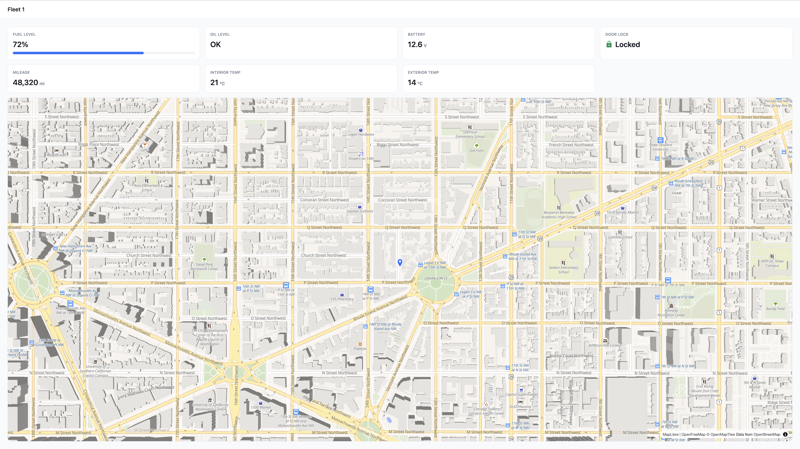

# FVS Dashboard

A self-hosted camper van status dashboard. Displays real-time vehicle metrics on a single screen — no navigation required.



## Panels

| Panel | Metric | Warning threshold |
|-------|--------|-------------------|
| Fuel Level | % (0–100) with fill bar | < 15% |
| Oil Level | OK / Low / Check | Low, Check |
| Battery | Voltage (V) | < 11.8V |
| Door Lock | Locked / Unlocked | Unlocked |
| Mileage | Odometer (mi) | — |
| Interior Temp | °C | — |
| Exterior Temp | °C | — |
| Location | Interactive vector map | — |

## Stack

- **React 19** + **TypeScript** (strict mode)
- **Tailwind CSS v4** with [Untitled UI](https://untitledui.com) design tokens
- **MapLibre GL** via `react-map-gl` — vector tiles from [OpenFreeMap](https://openfreemap.org) (no API key)
- **Vite** — static build output

## Getting started

```bash
npm install
npm run dev
```

Open [http://localhost:5173](http://localhost:5173).

## Deployment

Builds to static assets — serve with any web server:

```bash
npm run build
npx serve dist

# or point Nginx/Caddy root at dist/
```

## Data

The dashboard currently runs on stub data. To connect a real backend, replace the implementation in `src/services/vehicleService.ts` — the `VehicleService` interface stays the same, only the data source changes.

```
src/
├── types/vehicle.ts        # All data contracts
├── data/fixtures.ts        # Stub data (normal + warning states)
├── services/vehicleService.ts  # Swap this for a real API
└── components/panels/      # One component per status panel
```

## Specs

Feature specs, implementation plans, and research live in `specs/`. The project constitution (architecture principles) is at `.specify/memory/constitution.md`.
